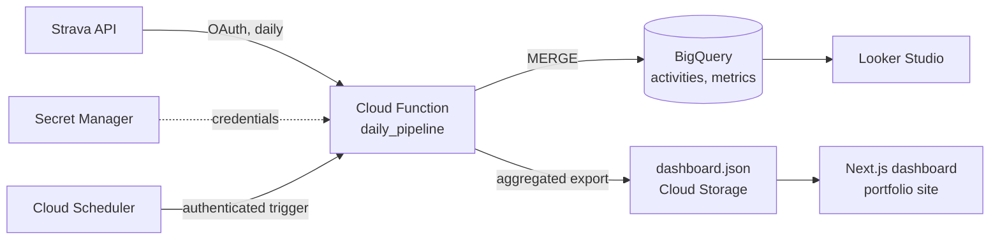

# Training Performance Dashboard

An end-to-end training analytics pipeline built on my own Strava data (running and CrossFit/HIIT).
Activities are ingested daily into BigQuery, sports-science load and fitness metrics are computed in
Python, and a small pre-aggregated JSON feeds a dashboard page on my
[portfolio site](https://github.com/ac-ozdemir/portfolio-website).

> **Status:** in progress — metric functions and warehouse schema are done; ingestion, deployment and
> the dashboard page are being built.

## Architecture



Runs entirely on Google Cloud's free tier. The dashboard reads a static, pre-aggregated JSON file, so
the website holds no cloud credentials and never queries the warehouse directly.

## Metrics

| Metric | Method | Code |
| --- | --- | --- |
| TRIMP | Banister's exponential training impulse, from session duration and average heart rate | [`trimp.py`](pipeline/metrics/trimp.py) |
| CTL / ATL / TSB | Performance Management Chart: 42- and 7-day exponentially weighted load, form = previous day's CTL − ATL | [`training_load.py`](pipeline/metrics/training_load.py) |
| VDOT (VO2max estimate) | Daniels & Gilbert, from race results and interval repetitions | [`vdot.py`](pipeline/metrics/vdot.py) |

All metric functions are pure and unit-tested.

## Repository layout

```
pipeline/
  metrics/      pure metric functions (no I/O)
  schema/       BigQuery DDL
  tests/        pytest suite
```

## Local development

```bash
cd pipeline
python3 -m venv .venv
.venv/bin/pip install -r requirements-dev.txt
.venv/bin/pytest
.venv/bin/ruff check . && .venv/bin/ruff format --check .
```

For scripts that call the Strava API locally, copy `pipeline/.env.example` to `pipeline/.env` and fill
in your own credentials. `.env` is gitignored; in the cloud the same values live in Secret Manager.

## Privacy

- GPS / route data is never stored — the schema deliberately omits polylines and coordinates.
- Only the author's own activity data is processed.
- Data provided by Strava. Powered by Strava.
