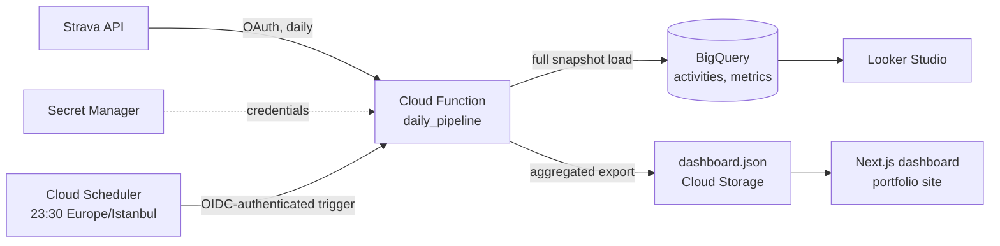

# Training Performance Dashboard

An end-to-end training analytics pipeline built on my own Strava data (running and CrossFit/HIIT).
Activities are ingested daily into BigQuery, sports-science load and fitness metrics are computed in
Python, and a small pre-aggregated JSON feeds a dashboard page on my
[portfolio site](https://github.com/ac-ozdemir/portfolio-website).

> **Status:** the pipeline runs daily in production (ingestion → BigQuery → metrics → public JSON).
> The dashboard page on the portfolio site is in progress.

## Architecture



Runs entirely on Google Cloud's free tier. The dashboard reads a static, pre-aggregated JSON file, so
the website holds no cloud credentials and never queries the warehouse directly.

Design choices worth calling out:

- **Full snapshot, not incremental.** The whole Strava history is three API pages, so every run
  rebuilds the `activities` table with a free load job. This picks up edits (renamed activities,
  races tagged after the fact) and deletions that an incremental merge would miss.
- **Least privilege.** Separate service accounts for the function runtime, the build and the
  scheduler. The runtime account can only touch its own dataset, bucket and secrets; the function
  rejects unauthenticated calls.
- **Self-healing credentials.** When Strava rotates the refresh token, the function stores the new
  one in Secret Manager and destroys the old versions.

## Metrics

| Metric | Method | Code |
| --- | --- | --- |
| TRIMP | Banister's exponential training impulse, from session duration and average heart rate | [`trimp.py`](pipeline/metrics/trimp.py) |
| CTL / ATL / TSB | Performance Management Chart: 42- and 7-day exponentially weighted load, form = previous day's CTL − ATL | [`training_load.py`](pipeline/metrics/training_load.py), [`daily.py`](pipeline/metrics/daily.py) |
| VDOT (VO2max estimate) | Daniels & Gilbert, from races and from interval reps | [`vdot.py`](pipeline/metrics/vdot.py), [`intervals.py`](pipeline/metrics/intervals.py) |

All metric functions are pure and unit-tested. Caveats, stated rather than hidden:

- TRIMP was designed for endurance sessions; for CrossFit/HIIT it is an approximation.
- Activities without heart-rate data count as zero load. Heart rate is only recorded consistently
  from November 2025, so the load series starts there, seeded with the opening period's mean load.
- Interval VDOT only uses manually lapped sessions (automatic 1 km splits are ignored), reps of
  2.5–6 minutes, run at ≥ 90% of lactate-threshold heart rate. It assumes interval pace ≈ velocity
  at VO2max. A race counts only when tagged as a race in Strava, which is reserved for races
  actually run all-out.

## Repository layout

```
pipeline/
  main.py       Cloud Function entry point (orchestration + structured logging)
  config.py     resource names and athlete parameters
  strava/       API client and pure payload -> row mapping (GPS never leaves here)
  metrics/      pure metric functions (no I/O)
  warehouse/    BigQuery reads and snapshot loads
  export/       public dashboard.json builder and publisher
  schema/       BigQuery DDL
  scripts/      local one-off runs
  tests/        pytest suite
  deploy.sh     deploy function + scheduler (idempotent)
```

## Local development

```bash
cd pipeline
python3 -m venv .venv
.venv/bin/pip install -r requirements-dev.txt
.venv/bin/pytest
.venv/bin/ruff check . && .venv/bin/ruff format --check .
```

To run the whole pipeline once from a laptop, authenticate as the runtime service account and run:

```bash
gcloud auth application-default login --impersonate-service-account=pipeline-runner@training-performance-dashboard.iam.gserviceaccount.com
cd pipeline && .venv/bin/python -m scripts.run_local
```

`pipeline/.env.example` documents the Strava credentials for ad-hoc local scripts. `.env` is
gitignored and never uploaded (`.gcloudignore`); in the cloud the values live in Secret Manager.

## Deployment

```bash
cd pipeline && ./deploy.sh
```

Deploys the function (Python 3.12, `europe-west1`, private) and creates or updates the Cloud
Scheduler job that triggers it nightly.

## Privacy

- GPS / route data is never stored — the schema deliberately omits polylines and coordinates.
- Only the author's own activity data is processed.
- Data provided by Strava. Powered by Strava.
